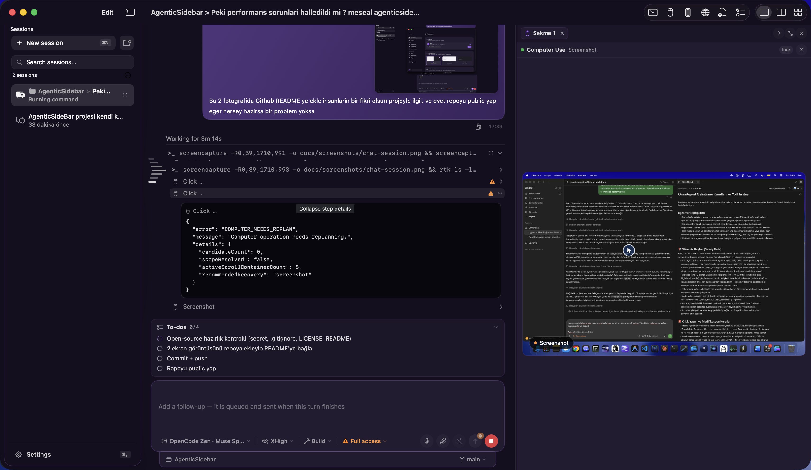
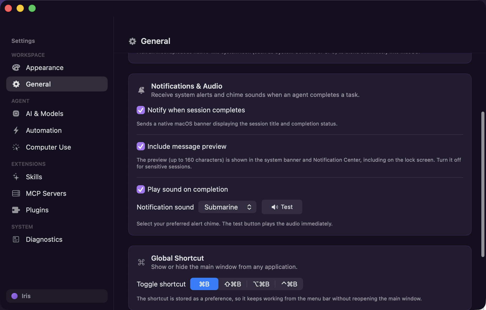

# AgenticSidebar

A native personal macOS agent app: a sidebar-style chat window that runs without a
Dock icon, can be summoned with a global shortcut, optionally reports session
state from the menu bar, and drives either the direct OpenAI Responses API or a
managed local OpenCode server.

## Screenshots





## Requirements

- macOS 26 SDK (the package targets `.macOS(.v26)`)
- Xcode 26 / Swift 6.2 or newer toolchain
- Optional: `opencode` on `PATH` or at `/opt/homebrew/bin/opencode` for the
  OpenCode backend

## Build and run

```bash
swift build --product AgenticSidebar    # compile
./script/build_and_run.sh               # build, bundle, sign and launch
./script/build_and_run.sh --logs        # launch and stream process logs
./script/build_and_run.sh --telemetry   # launch and stream subsystem logs
./script/build_and_run.sh --verify      # launch and assert the process is up
```

The script assembles `dist/AgenticSidebar.app` (Dock-less, `LSUIElement`), signs
it with an Apple Development identity when one is available, and otherwise falls
back to ad-hoc signing — ad-hoc signatures make macOS re-prompt for Keychain
access after every rebuild.

## Sessions

Conversations are first class: the sidebar lists them, "New session" starts one, and
each session owns its own turn task, so a background conversation keeps streaming while
you read or type in another one. The list is stored as JSON in
`~/Library/Application Support/AgenticSidebar/sessions.json` with atomic writes, and
an unreadable archive is moved aside as `sessions.corrupt.json` rather than being
discarded or crashing the app.

The activity timeline is stored with the transcript, so the commands a turn ran are
still there — collapsed under "Thinking" — after a relaunch. A turn that was still
running when the app quit is closed on restore rather than left counting up. The
archive stays bounded: the newest 120 activities per conversation are kept, each tool
result is capped at 4,000 characters with the truncation marked, and a timeline whose
message is gone is dropped.

Context survives an interruption, not just the transcript on screen. Prompts still
waiting in the queue and the text you had typed but not sent are archived with the
conversation and come back on the next launch. The OpenCode server, however, keeps its
own copy of a conversation and forgets it when the app stops it, so the first turn of
a fresh backend session carries the earlier turns as quoted history inside the prompt
— the model reads what happened before it answers, and no restored tool is re-run.
Later turns need nothing, because the backend session holds them from then on.

Long conversations are trimmed to a request budget (the newest messages are kept and
the window starts on a user turn); the chat view says how many messages were left out,
and the stored transcript always stays complete.

Streaming hops use bounded channels, so a fast provider cannot turn the UI queue into
unbounded memory growth — the reader is pressed back instead.

A session can be bound to a working folder: the folder button beside "New
session" binds the unsent draft (tapping it again unbinds), and folder-bound
sessions are listed as "Folder > Title". The layout picker offers single,
side-by-side and 2×2 panes; each pane streams independently with its own
incremental rendering, and the same conversation can never occupy two panes.

While a folder-bound session changes files, a `doc.badge.plus` button appears
in the toolbar (single pane) or the pane header (side-by-side): it opens the
session's file changes in the side panel with per-file `+`/`-` diffs, and
re-tapping refreshes the snapshot as the turn progresses. The side panel
collapses to an icon rail with the chevron in its tab bar (per session, tabs
and live terminals survive collapsed) and reopens from any rail icon.

## Agent mode and the prompt queue

The composer's mode menu mirrors the speed menu: **Build** is the agentic default, and
**Plan** asks the assistant to investigate read-only and answer with a single `plan`
block. That block is rendered as a document card rather than chat prose, and the only
way forward is the **Approve & Build** bar under it, which flips the session back to
Build mode and hands the plan back as an ordinary user turn. OpenCode Plan turns
select a dedicated `agenticsidebar-readonly` backend agent: its generated permission
rules deny tools by default and allow only named read-only capabilities. The plan
instruction still controls the answer's format. The direct OpenAI path has no tool
execution in this app and uses the plan instruction. The approval bar controls the
app workflow; it is not an operating-system permission boundary. The OpenCode agent
selection and generated rules are covered by tests, not by a live inference probe.

A message sent while a turn is running is queued instead of being refused: queued
prompts keep the speed and mode they were sent with, appear as a strip above the
composer, drain in order when the turn settles, and survive a cancellation. The strip
is editable — a pencil rewrites a queued message in place without moving it, and the
grip handle on the left drags a row to a new position, because that order is the order
the turns will run in. Those are decisions about work the agent has not started yet.

Once a turn is over, your own messages carry two actions as well: **Write again** puts
the message back in the composer to be edited and sent, and the copy button takes the
text as it was sent. Both wait for the turn to finish, since re-sending mid-turn would
only queue a duplicate of something you have not seen answered.

Activity rows in the timeline expand into what the tool actually did — a `+`/`-` diff
for a file change, the contents read, or the console output of a command. "Thought for
Ns" is measured, counts up while the turn is still thinking, and stops when it ends.

## Navigating a long conversation

One bar per prompt lives in the left gutter, drawn as a spindle: the bars grow and
drift right toward the middle of the column, and the bar for the prompt being read is
filled with the theme accent. Clicking a bar scrolls that prompt to the top of the
transcript; hovering shows the prompt itself. The column appears once a conversation
has more than one prompt, and the transcript reserves its width so the bars never sit
over the text.

The transcript follows a streaming answer to the bottom on its own, and stops only
when you scroll away. Follow mode is changed by your own scrolling — never by the
answer growing underneath it — so a long conversation cannot strand the view halfway
up its own history. Two details make that rule hold on a real trackpad and a real
mouse wheel. Ownership of the position is yours the moment the measured offset
*falls*: content growing below never lowers the offset, so a fall cannot be
mistaken for growth, and it works whether or not the input device reports a scroll
phase at all. And "at the bottom" means within 40 points of it, not 120: at 120 a
few lines scrolled up were still close enough for the answer to keep pulling the
reader back down.

The transcript is rendered lazily and the lazy stack is not given an implicit
animation, because animating it made SwiftUI lay out every row on every change and
lock up on a long conversation.

While an answer streams, only the blocks that changed are re-typeset and re-laid
out. Rebuilding the whole run on every flush cost 10–41 ms of typesetting plus
7–27 ms of layout at 4–27k characters, against a 16–40 ms flush cadence — the main
thread never idled, which is what made scrolling stutter and feel held. Measured
over 30 flushes of a growing answer, the old path went 2.7 → 15.1 ms per flush and
the new one stayed at 0.6 → 0.8 ms.

## One backend per app, and nothing left behind

The app runs a single managed OpenCode server: it starts one when the window
appears, reuses it for every conversation, and stops it — with the MCP servers
that server started — when the app ends. "Ends" is the part that used to be a
lie:

- **The whole tree is stopped, not just the child.** The backend spawns a process
  per MCP server, and `Process.terminate()` only reaches the process it launched.
- **A signal runs the same shutdown.** `applicationShouldTerminate` is only
  consulted for a graceful quit, so `pkill`, a logout or a crash used to kill the
  app and leave its backend running. `SIGTERM`/`SIGINT` are handled with dispatch
  sources and go through the same bounded cleanup as a quit.
- **Leftovers are adopted and ended at the next launch.** Each server records a
  lease (`OpenCode/servers/<pid>.json`) while it runs; at startup a live lease is
  ended after its command line is checked — pids are reused — and any *orphaned*
  process with this app's exact launch shape (`serve --hostname 127.0.0.1 --port
  … --pure`, parent `launchd`) is ended too. A server you started yourself in a
  terminal does not match either check and is left alone.
- **The development script waits** for the old instance to finish its cleanup
  instead of racing the new one against it.

An MCP server that is switched off is no longer merely silenced: it is declared
`enabled: false`, so OpenCode does not start the node/python process behind it at
all. Silencing its tools stays as well, for a server only your own
`opencode.json` knows about.

## The agent's task list

When the agent tracks its work as tasks — OpenCode's own todo tool — the app reads
that list from the session (`GET /session/:id/todo`) and shows it as a collapsible
card above the turn it belongs to: a `completed/total` count in the header, a
filled check for what is done, and an accent ring for what is being worked on. It
refreshes as the agent writes it, again when the turn ends, and when a
conversation is reopened. Providers with no such concept (the direct OpenAI
path) show no card at all.

## The composer

One control beside the model holds the two settings that answer the same
question — how hard the model should work on this turn: the **reasoning effort**
(the model's own variants, with the default marked) and **fast mode**. Its chip
reads `XHigh · Fast`. The agent mode (Build / Plan) and the tool approval level sit
next to it. The provider is *not* there: it is a long-lived choice about how the app
is wired, so it is chosen in Settings → AI & Models — and the approval level has no
"more info" link either, because the card in Settings explains the levels and a
control row that points at its own explanation reads as part of the decision. Every
control in the row, and every other clickable thing in the window, lifts a
theme-tinted highlight under the pointer and switches the cursor to a hand.

An answer is selectable in one drag: consecutive prose blocks of a message are laid
out in a single text view, so the selection no longer stops at every paragraph,
heading or list item — SwiftUI gives each `Text` its own text view, which is exactly
where a drag used to break. Code blocks, tables, charts and plan documents keep
their own views (and their own copy buttons) and end that run. Provider marks are
vector paths drawn in-app, so they stay sharp without an asset catalogue.

Pasting a document does not slow the app down, and neither does switching
between long conversations: the per-keystroke work is bounded to a prefix of the
composer's text and a window at its end, the rail's titles and the activity
anchors are computed once per change rather than once per frame, and a bounded
shared cache keeps markdown parses across conversation switches. See
`docs/verification/2026-09-16-composer-and-transcript-performance.md`.

## Simulator and live panels

The right-hand **iOS Simulator** tab shows a booted device's screen inside the
app and lets you tap and drag on it directly:

- The fluid path is a live window stream (`SCStream`, ~12 fps, capped at 900 px
  wide) of the Simulator/DeviceHub window for the selected device. It needs the
  device window on screen and **Screen Recording** granted to AgenticSidebar;
  without either, frames fall back to `simctl io screenshot` (~2 fps). The
  footer badge says which path is active (`Canlı`, `simctl · ~2 fps`, or an
  `Ekran Kaydı` prompt), so a slow view is never a mystery.
- Capture runs only while the panel is visible and only for the selected booted
  device. Touches go to the device over the HID bridge; typing still wants the
  real device window (`Open window` brings it forward without stealing focus
  when booting).
- The same on-visibility rule holds for the Computer live view: no hidden
  screen capture while its panel is closed.

## Extensions: MCP, plugins and skills

Settings → **MCP & Plugins** is where the agent's reach is decided. It is
organised by what an extension costs the model rather than by what it is:

- **MCP servers** add the schema of every tool they expose to every request, so
  only the ones you switch on are registered. A server that is listed but off is
  silenced by name in the generated configuration (`tools.<name>_* = false`),
  which also covers a server that lives in your own `~/.config/opencode/`
  configuration — that file is read, never edited. A remote server that needs
  OAuth opens its authorization page from its row.
- **Plugins** are npm modules that run inside the agent; they cost nothing until
  they add tools of their own, and the screen says plainly that they are code.
- **Skills** cost one line each: OpenCode advertises only the name and
  description and loads the body when the model asks for it. They can be found
  on [skills.sh](https://skills.sh) and installed from there, or from any
  `owner/repo` plus the skill's folder name. Every `SKILL.md` is validated
  against the rules OpenCode enforces before it is written, so a skill that would
  silently fail to appear is refused with a reason instead.

In the composer, `@` lists the MCP servers and plugins a turn may use and `/`
lists the skills. Choosing one turns the typed token into a chip that rides with
the message; the tag adds a few lines of instruction to that turn only, and an
untagged turn adds nothing.

MCP servers and plugins are loaded when the agent starts, so a change there
applies on the next start — the tab has a **Restart agent** button for exactly
that. Skills are discovered from disk on every appearance.

Because the model's context is the thing being protected, the app writes its own
configuration (`managed-config.json` inside
`~/Library/Application Support/AgenticSidebar/OpenCode/`) and hands it to
OpenCode through `OPENCODE_CONFIG`; OpenCode merges it with the user's own
configuration, and nothing in the user's files is rewritten.

## Tests

```bash
swift test
```

The suite is hermetic apart from `KeychainCredentialStoreTests`, which writes and
deletes its own throwaway item in the login keychain.

## Configuration

- **OpenAI**: the API key is stored in the login Keychain (`com.dogan.AgenticSidebar`,
  account `openai.api-key`) and read at request time. Responses are requested with
  `store: false`, so the transcript stays local.
- **OpenCode**: Settings starts `opencode serve` bound to `127.0.0.1` with a
  randomly generated server password, discovers providers/models/variants from the
  running server, and forwards provider credentials through OpenCode's own auth
  API. The app never downloads or updates the OpenCode binary.
- **Automation**: clipboard and screenshot automation are opt-in. Both ignore
  pasteboard content that applications mark as concealed or transient.
- **Capture privacy**: best effort only. macOS offers no supported API that
  guarantees this window is excluded from system screenshots or third-party
  recorders; see `docs/verification/`.
- **Tool approvals**: one level for every tool — shell commands, edits, the
  network and computer use — chosen in Settings → AI & Models or from the level
  control in the composer and on a waiting approval card:
  - **Ask** — reads and in-folder edits run; every shell command, every path
    outside the working folder and every network call waits for your decision.
  - **Approve for me** — a fresh install no longer starts here; it asks about
    anything potentially unsafe without burying the user in prompts. A short
    list of exact inspection commands (`git status`, `git diff`, `ls`, `pwd`
    and selected fixed variants) and exact build/test commands run unattended
    within the working folder. Other commands, including arbitrary flags,
    commands that can change state, external paths and network access, require
    approval.
  - **Full access** — **this is the default**, so a fresh install acts fast:
    shell, edits, fetches, computer use actions and the authority lease run
    without a prompt. It answers the requests the agent raises; a `deny` in
    the user's own `opencode.json`, and the app's own `deny` for the
    computer-use file, git, terminal and full-host JavaScript
    (`computer_run_js`) tools, still apply — a denied tool is never asked
    about, so no level can allow it.

  The level is captured when a turn starts, not written into the agent's
  configuration, so changing it applies from the **next turn**: a running turn
  keeps answering with the level it started with, and prompts already on screen
  are not re-answered mid-turn. "Always
  allow" from a prompt is remembered for the session and can be revoked in
  Settings. Automatic approvals are one-shot, so switching back to a stricter
  level is never silently overridden by an earlier auto-answer. A shell command
  only runs unattended when it is a *single* simple command whose paths stay
  inside the working folder — a trusted prefix chained with `&&`, `;`, `|` or a
  redirect asks instead.

  ### What the level can and cannot decide

  The level decides the requests that **reach the app**, and the app's
  configuration is one of the files OpenCode merges — not the last word. Two
  other sources produce rules that outrank it, and a capability either of them
  allows never raises a request, so no level can ask about it:

  - an `agent` definition's `tools` map. OpenCode turns every enabled tool into
    an agent-level `allow` (`bash: true` becomes `permission.bash: allow`), and
    that rule is applied after the configuration. The built-in `build` agent
    enables the shell, edits and reads; subagents likewise inherit whatever their
    own definition enables.
  - the user's own `~/.config/opencode/opencode.json` and
    `~/.opencode/opencode.json`, which are merged after the app's file.

  Measured on OpenCode 1.18.31: with only the app's configuration in play, an
  explicit `bash: ask` does raise a request (`bash(echo probe-one)`); with the
  machine's own `~/.opencode/opencode.json` in place, the same command resolves to
  `allow` and no request is ever raised — in the parent session and in a
  delegated subagent alike. The approval level therefore governs the families the
  agent does not declare: paths outside the working folder, `todowrite`, `skill`,
  `task` (the subagent delegation itself), web fetches and searches, the
  doom-loop guard, MCP tools and every `computer_*` tool. Settings → AI & Models →
  Recent tool activity shows which requests actually arrived.

  The Plan agent is unaffected by that precedence: it is defined by the app with
  an explicit `permission` block and no `tools` map, so its read-only boundary is
  enforced by the backend rather than asked about.
- **Delegated subagents**: the agent can hand a piece of work to a subagent
  through the `task` tool, and that subagent runs in an OpenCode child session of
  its own. Its permission requests carry the child session's id rather than the
  turn's, so the app treats them as first-class rather than foreign: they are
  delivered no matter which session raised them, they are answered by the same
  level (or by hand, from the approval card), and the card says *Delegated
  subagent* so a question asked on the agent's behalf is not mistaken for the
  turn's own. Stopping a turn clears the requests a delegated session left
  waiting, so nothing stays on screen after the work behind it is gone. Two limits
  are worth knowing: a subagent's own definition decides what it may do without
  asking (see above), and Plan mode refuses `task` itself, so delegating is
  unavailable there rather than merely asked about — a child session runs with its
  own definition's tools, which would otherwise be a way around the read-only
  boundary.
- **Audit trail**: permission decisions and observed tool execution events are
  distinct JSONL records in
  `~/Library/Application Support/AgenticSidebar/OpenCode/audit.jsonl` (rotated at
  20 MB, kept 5 files, mode `0600`). Settings → AI & Models → Recent tool
  activity displays both. Decisions record why a request was answered, but a
  decision does not prove execution. Execution records mark observed starts and
  completions, including tools that required no permission prompt. They record
  session/activity identifiers and tool kinds, not command arguments, file
  contents or tool output; this trail cannot reconstruct every command or path.
- **Computer Use**: opt-in in Settings → Computer Use. The app registers the
  local [`chatgpt-system`](https://github.com/senoldogann/chatgpt-system) MCP
  server with the managed OpenCode server (`POST /mcp`) and starts it with
  `--personal-admin --enable-computer-use`; the repository itself is never
  modified. Permission rules and model instructions are written to the app's own
  `computer-use.json`/`computer-use-instructions.md` inside
  `~/Library/Application Support/AgenticSidebar/OpenCode/` and passed through
  `OPENCODE_CONFIG`, so the user's `opencode.json` stays untouched. Only
  `computer_*` and `session_authority_*` tools are exposed: the filesystem, git,
  terminal, browser and full-host JavaScript tools stay denied by the app's own
  rules whatever the tool approval level is, and `computer_*` /`session_authority_*`
  requests are decided by that level like every other tool.

  The first run needs the helper installed once with
  `npm run setup:computer:macos` in the chatgpt-system folder. The tab does not
  leave  the user to guess whether that worked: it resolves the folder, Node and
  `dist/cli.js`, inspects the installed helper's bundle identifier and signature,
  and then reports each grant **from the process macOS asks for it**. That
  distinction is the whole point of the card, because the four grants do not
  share an owner: Accessibility, Input Monitoring and posting events are the
  signed helper's, while Screen Recording is enforced on the *responsible*
  process — whoever launched the helper — so it is this app's. The tccd log shows
  it plainly: the same helper binary reports `screenCaptureAuthorized: true` when
  a granted process starts it and `false` from inside AgenticSidebar, even with
  **ChatGPTSystemComputerRuntime** switched on in System Settings. A card that
  read all four from the helper would therefore be right about three and
  confidently wrong about the one that breaks screenshots.

  The card leads with one line (Ready, or exactly which grant is missing and
  which process owes it), deep-links each missing grant to the Privacy &
  Security pane that owns it, and offers a **Grant Screen Recording…** button —
  the app can only *ask*, which is what makes macOS list AgenticSidebar itself so
  the switch is findable at all. It also reveals the helper in Finder for the “+”
  button, and can run the two setup commands itself (through `env`, never a
  shell). A helper that does not answer is reported as unknown, never as denied. See
  `docs/verification/2026-09-16-computer-use-integration.md` and
  `docs/verification/2026-09-16-computer-use-readiness-and-permissions.md`.

## Documentation

- `docs/superpowers/specs/` — product/architecture specification
- `docs/superpowers/plans/` — milestone implementation plans
- `docs/verification/` — recorded host verification evidence
- `docs/reviews/` — code review reports (findings, evidence and their resolution)
- `.ai-architect/` — architecture contract and accepted ADRs

## Continuous integration

`.github/workflows/ci.yml` builds and tests on a macOS 26 runner. A runner without
the macOS 26 SDK cannot compile this package.

Both steps run with `-Xswiftc -warnings-as-errors` — the tree is warning-free, and
that is the state worth holding. Superseded pushes are cancelled by a `concurrency`
group, the SwiftPM build is cached, and the single test that touches the real login
keychain skips itself unless `RUN_KEYCHAIN_TESTS=1` is set, so what CI proves is the
hermetic suite. `swift-format lint` runs as a third step and **is a gate**: the
  tree is formatted to the checked-in `.swift-format`, so a new violation fails the
  build the same way a new warning does.

## Contributing

- `swift build --product AgenticSidebar` and `swift test` must stay clean with
  `-Xswiftc -warnings-as-errors`; `swift-format lint -r --strict Sources Tests`
  (pinned version in `ci.yml`) is a gate, not a suggestion.
- Never commit `dist/`, `.build/`, `DerivedData/`, `as-review/`, `.freebuff/`,
  lease files under `servers/`, or anything with a secret. API keys live in the
  login Keychain and server passwords rotate on every start — neither belongs
  in a file that ships.
- `docs/verification/` holds dated host evidence; small machine-specific paths
  in old notes are history, not configuration. New docs should prefer `~` and
  relative paths.

## License

MIT — see `LICENSE`.
# CI trigger
